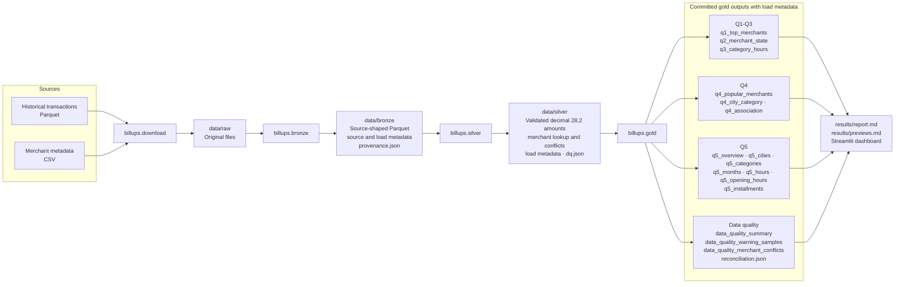
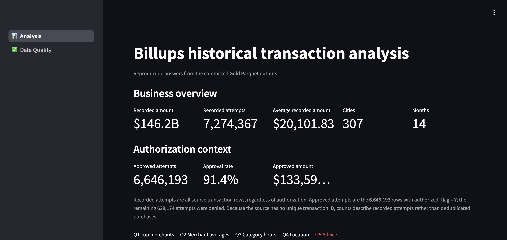
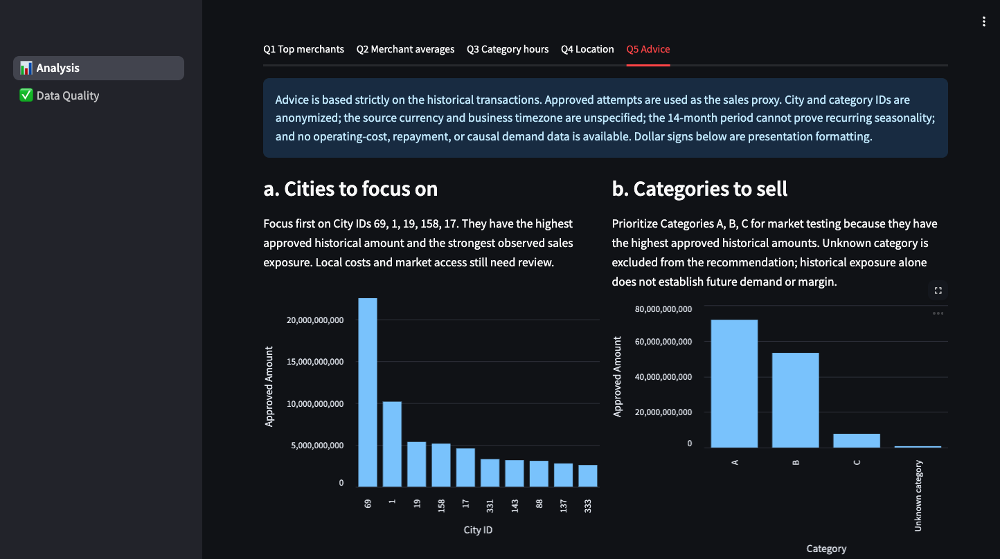

# Billups data engineering challenge

A local PySpark Bronze/Silver/Gold pipeline answering the five questions in the supplied Billups case. The repository includes the generated Gold Parquet tables, an analytical report, bounded previews, and a Streamlit dashboard, so results can be reviewed without rerunning the 7.27-million-row pipeline.

## Results

- [Analytical report](results/report.md)
- [Bounded result previews](results/previews.md)
- `data/gold/`: committed dashboard-ready Parquet outputs for all five questions and data quality

The official run preserved and reconciled 7,274,367 transaction attempts totaling 146,228,071,619.26 supplied monetary units. Recommendations compare all attempts with approved exposure; the report states the limitations around authorization, timezone, currency, costs, and installments.

Recorded attempts count every source transaction row, including denied authorizations. Approved attempts are the rows where `authorized_flag = Y` and are used as the closer proxy for realized sales. The source has no unique transaction ID, so neither count is a deduplicated purchase count.

## Architecture



The three stage commands form a deterministic linear batch. Bronze preserves and fingerprints the inputs, Silver validates and enriches every transaction attempt, and Gold publishes the business and quality tables consumed by the report and dashboard.

## Requirements

- Python 3.12
- Java 17
- [uv](https://docs.astral.sh/uv/)

### Install Java 17

PySpark requires a Java Development Kit before it can start its local JVM. Download the **Eclipse Temurin 17 JDK** from the [official Adoptium release page](https://adoptium.net/temurin/releases/?version=17), select your operating system and CPU architecture, keep package type **JDK** and version **17**, and run the provided installer.

The [official Adoptium installation guide](https://adoptium.net/installation/) also documents package-manager installation for macOS, Linux and Windows. After installation, open a new terminal and verify that Java 17 is active:

```sh
java -version
```

The output must start with version `17`. If another version appears, configure `JAVA_HOME` to point to the Java 17 installation. On macOS with multiple JDKs installed, select Java 17 for the current shell with:

```sh
export JAVA_HOME=$(/usr/libexec/java_home -v 17)
java -version
```

Install the exact locked environment:

```sh
uv python install 3.12
uv sync --python 3.12 --locked --dev
```

PySpark is pinned to 3.5.6. All full-population transformations, quality checks, business metrics, statistical association, rankings, shares, and recommendations use native PySpark DataFrame functions. The project does not use Spark SQL. Streamlit and Altair only format and visualize bounded Gold outputs.

## Review the dashboard without running the pipeline

The dashboard reads the committed `data/gold` tables. Use the sidebar to switch between the five-question analysis and the data-quality review:

```sh
uv run streamlit run dashboard.py --server.headless false
```

The command keeps running in that terminal, prints `http://localhost:8501`, and asks the operating system to open the default browser. If no tab opens, visit [http://localhost:8501](http://localhost:8501) manually. It opens Chrome automatically only when Chrome is the system default browser.

For the written analysis, open [results/report.md](results/report.md). The supporting bounded rows are in [results/previews.md](results/previews.md), while the dashboard presents the same committed Gold tables interactively.

## Download the official source files

The repository does not commit raw, Bronze, or Silver data. Download both official sources atomically into `data/raw`:

```sh
uv run python -m billups.download --destination data/raw
```

The command creates these exact paths:

```text
data/raw/historical_transactions.parquet
data/raw/merchants.csv
```

The links come from the supplied challenge PDF. The script leaves an existing file untouched and downloads through a temporary file before renaming it.

If downloading manually, use the links below and rename/place the files exactly as shown:

- [Historical transactions Parquet](https://billups-tech-interview.s3.us-west-2.amazonaws.com/engineering/data-engineering-task/interview_historical_transactions.parquet/part-00000-tid-860771939793626614-979f966a-6d53-4896-9692-f81194d27b99-109986-1-c000.snappy.parquet) → `data/raw/historical_transactions.parquet`
- [Merchant CSV](https://billups-tech-interview.s3.us-west-2.amazonaws.com/engineering/data-engineering-task/merchants-subset.csv) → `data/raw/merchants.csv`

## Run end to end

Run the complete full-refresh pipeline with one command:

```sh
uv run python -m billups.pipeline
```

Every trigger replaces the generated layers and reports with outputs from the current raw inputs:

```text
data/
├── raw/       # untouched source files
├── bronze/    # overwritten source-shaped Parquet and provenance
├── silver/    # overwritten validated/enriched Parquet and DQ
└── gold/      # overwritten business tables and reconciliation
results/
├── report.md
└── previews.md
```

The run creates a short audit trail:

- Each Bronze row records `source_file_name` and `bronze_load_timestamp`. `data/bronze/provenance.json` also records each input file's byte size and SHA-256 fingerprint. The fingerprint changes if any byte in the downloaded file changes, so it identifies the exact source files used by a run.
- `data/silver/dq.json` records full-population quality counts calculated while Silver validates and enriches the transactions. Warning rows remain in the data; fatal schema, parsing, fan-out, and empty-input failures stop the run.
- `data/gold/reconciliation.json` proves that the Gold city aggregate has the same row count and monetary total as Silver.
- `data/gold/data_quality_summary`, `data_quality_warning_samples`, and `data_quality_merchant_conflicts` publish those checks for the dashboard. They allow the committed Data Quality page to run without local Silver files.
- `data/gold/q4_association`, `q5_overview`, and `q5_opening_hours` publish the final statistical and recommendation results. Rankings, shares, and installment profitability rates are also stored in their respective Gold tables, so the report and dashboard do not recalculate business metrics.

Silver stores `purchase_amount` as `decimal(28,2)` and adds `silver_load_timestamp` while preserving the Bronze source metadata on transactions. Every Gold Parquet table adds `gold_load_timestamp`. These technical timestamps remain in the data layers but are intentionally omitted from the analytical report, previews, and dashboard tables.

The source has no unique transaction identifier, so identical-looking records cannot be proven to be accidental duplicates. The pipeline preserves repeated attempts and does not publish an unsupported exact-duplicate count.

### How data quality is calculated

Silver evaluates the complete transaction population with PySpark aggregates. For row-level checks, the displayed rate is `affected rows / 7,274,367 processed rows`. Merchant identity collisions are counted at merchant-ID grain, so their dashboard rate is intentionally blank rather than mixing two populations.

The checks have three outcomes:

- **Failed checks stop the stage:** missing required columns, empty transactions, invalid or null parsed dates, invalid or null monetary amounts, merchant join fan-out, Silver row-count loss, or failed Gold row/amount reconciliation.
- **Warnings preserve and label valid but uncertain data:** missing merchant IDs, unmatched merchant lookups, null/blank categories, unknown city/state identifiers, unknown authorization values, nonpositive amounts, unknown installment values, and merchant IDs with conflicting names.
- **Informational checks describe the population:** rows processed and denied authorizations. A denied attempt is retained because the challenge asks about recorded transaction activity as well as approved exposure.

For presentation, Gold converts the Silver counts into a long summary table, exports at most five deterministic example rows per supported warning, and copies the 41 merchant-name conflicts. These outputs do not recalculate or alter transaction data.

Open the dashboard after the run:

```sh
uv run streamlit run dashboard.py --server.headless false
```

Keep this terminal running while using the dashboard. Streamlit prints the local URL, normally [http://localhost:8501](http://localhost:8501), and asks the operating system to open the default browser. Open that URL manually if the browser does not appear. If the command exits without a URL, recreate the environment with the two installation commands in the Requirements section; this avoids a stale or broken Python interpreter in `.venv`.

## Run individual stages

The same pipeline can be run at explicit stage boundaries. Each command validates that its required upstream datasets exist and overwrites only its own output layer.

1. Raw to Bronze, including source SHA-256 provenance:

   ```sh
   uv run python -m billups.bronze
   ```

2. Bronze to Silver, including validation, cleanup, merchant enrichment, ambiguity evidence, and DQ metrics:

   ```sh
   uv run python -m billups.silver
   ```

3. Silver to Gold, including all five business questions, reconciliation, committed quality views, report, and bounded previews:

   ```sh
   uv run python -m billups.gold
   ```

4. Open the dashboard:

   ```sh
   uv run streamlit run dashboard.py --server.headless false
   ```

This is the local equivalent of an ordered three-task DAG:

```text
data/raw → billups.bronze → billups.silver → billups.gold → dashboard
                 └──────── billups.pipeline runs all three ────────┘
```

Rerun a downstream command when only that layer needs rebuilding. For example, changing business logic requires only `billups.gold` when `data/silver` is current. This provides the useful behavior of an ordered DAG without an orchestration framework or run-state subsystem.

All paths can still be overridden through CLI arguments when testing in temporary directories. Run `uv run python -m billups.<stage> --help` for the available options.

## Debug with the notebook

Install the optional notebook tools and start JupyterLab:

```sh
uv sync --python 3.12 --locked --dev --group notebook
uv run --group notebook jupyter lab notebooks/data_debugging.ipynb
```

The notebook reads `data/bronze`, `data/silver`, and `data/gold` lazily with PySpark. It includes schema inspection and small query examples without embedding source rows or outputs in Git. Run the required pipeline stage first if a local layer does not exist.

## Verify

Run the hand-computable Silver, Gold, report, and edge-case checks:

```sh
uv run pytest -q
```

## Data handling

`data/raw`, `data/bronze`, and `data/silver` are ignored by Git. Their directories can exist locally without committing source or intermediate data. Only the final Gold data under `data/gold` is committed. The dashboard has no dependency on raw, Bronze, or Silver files.

## Dashboard preview

The dashboard can be reviewed from the committed Gold outputs. These screenshots provide a quick preview before running Streamlit locally.

### Business overview



### Merchant recommendations


